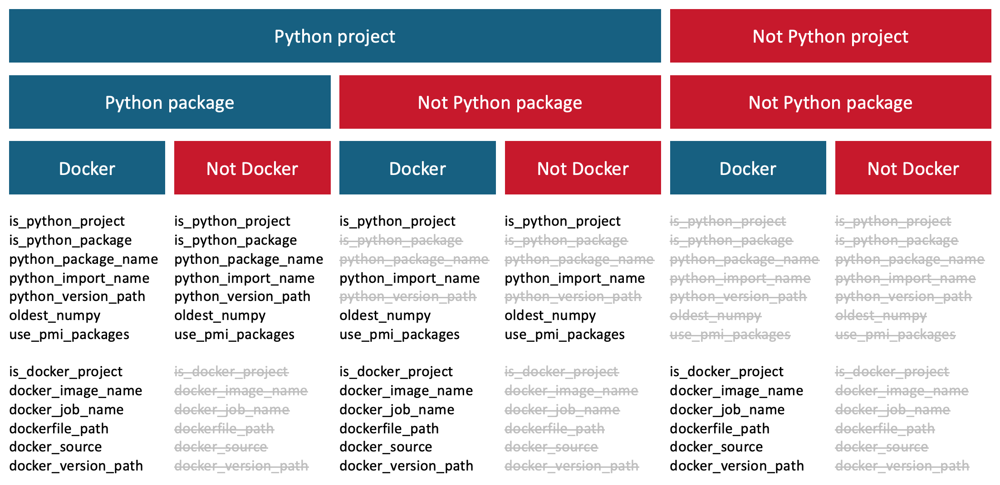

# copier-mlops-template

Provides configuration files and CI templates for use across repositories:

Common uses `copier` to init and update standard configuration files based on a standard template (`./template`).  
Common CI (`./.ci`) provides CI templates for Azure Pipelines, and should be referenced by git ref or git tag.

> We refer to this repo as `common` and any repo that uses `common` resources as a _"downstream"_ repo.

## Table of Contents

- [copier-mlops-template](#copier-mlops-template)
  - [Table of Contents](#table-of-contents)
  - [Use `common` with `copier`](#use-common-with-copier)
    - [Install `copier`](#install-copier)
    - [Repo config initialization with `copier`](#repo-config-initialization-with-copier)
    - [Repo config update with `copier`](#repo-config-update-with-copier)
      - [`copier update` deep dive](#copier-update-deep-dive)
  - [Using `Common CI`](#using-common-ci)
  - [Updating `common` source](#updating-common-source)
    - [Notes on package versions](#notes-on-package-versions)
  - [`common` organization](#common-organization)

## Use `common` with `copier`

[`copier`](https://copier.readthedocs.io/en/latest/) is a CLI app for rendering and updating project templates.
We call `copier` on each local repo, and `copier` will ask questions and render config files.
In the future, if config updates are needed, we can run `copier update`, which will re-render the config files
and show changes for manual merging (if required).

### Install `copier`

Requirements:

> `pipx` is preferred when possible, followed by `brew` (or your package manager of choice),
> and finally by per-environment `conda` or `pip` installs

1. Python >= 3.8
2. [`pipx` installed](https://github.com/pypa/pipx#install-pipx)

Dependencies:

```sh
# python tooling
pipx install black
pipx install ruff

brew install hadolint
brew install markdownlint-cli
brew install prettier
brew install shellcheck
```

Installation:

```sh
# copier workflows depend on pre-commit
pipx install pre-commit
# Configure pre-commit to auto-install for every repo with a .pre-commit-config.yaml file:
git config --global init.templateDir ~/.git-template
pre-commit init-templatedir ~/.git-template
# install copier
pipx install copier
```

### Repo config initialization with `copier`

1. In your project repo, run `copier template_src destination_path`, with  to the Azure Repo:

     <!-- markdownlint-disable MD013 -->
   ```sh
   cd <git project dir>
   copier copy --vcs-ref "release" repo_url . --UNSAFE
   copier copy --vcs-ref master https://github.com/foo/copier-template.git ./path/to/destination
   ```

   > To specify specific template version to use, provide a specific semver tag for `--vcs-ref <semver>` command flag:
   >
   > ```sh
   > copier copy --vcs-ref "1.0.0" repo_url . --UNSAFE
   > ```
   <!-- markdownlint-enable -->

2. `copier` will prompt with questions to ensure proper setup.  Answer all questions!

   Conceptually, we will define projects as `python` projects, `docker` projects, or both.

   ```txt
   🎤 Project name (repository name)
      dtsc-testproject
   🎤 Project description
      This is a test - this is only a test.
   🎤 Project: Python version to use [default: 3.10]
      (Use arrow keys)
      3.9
    » 3.10
      3.11
   ```

   Copier logic is as follows:

   

3. If `copier` will render files that already exist, it will ask whether you want to keep current files or overwrite.

   - **Overwrite(Yes/No)** - Overwrite file from template repository if answer yes else it will keep your local changes
   - **Identical** - Do not perform any copy/update if both downstream repo and common repo template is similar
   - **Create** - Create a file if not exist in downstream repository

4. `copier` will save responses in `.copier-answers.yml` at the project root.

5. You may need to manually update rendered configuration files, especially if:

   - you update the `CHANGELOG.md`
   - additional packages are required in `environment*.yaml` or `requirements.txt`
   - your project requires packages in Azure PIP repository; these are specified in `dtsc-requirements.txt`
   - additional typo corrections are required in `.typos.toml`
   - alterations are needed in `.gitignore` or `.dockerignore`
   - multiple docker image builds are needed in `.ci/azure-pipeline-publish.yaml`

   > If you notice you make the same alteration in several different project repos,
   > it may be worthwhile creating a PR to update `common` source so it is available across all projects!

### Repo config update with `copier`

If `common` source releases a new version, `copier` make it easy to update downstream repos.

> **!! DO NOT MANUALLY UPDATE `.copier-answers.yml` !!**

1. Navigate to project directory: `cd <git project dir>`
2. Ensure a `feature` branch is checked out.
3. Commit (or stash) current work.  Copier will not work with "unclean" file statuses.
4. Run `copier update`.  This will try to render files based on the _latest_ release of `common`:

   ```sh
   copier update --vcs-ref "release" . --UNSAFE
   ```

> If `copier` is unable to resolve the diff between current and latest revisions,
> it will create `*.rej` files that contain the unresolved differences.
> These must be reviewed (and resolved/implemented) prior to commit (this is enforced by `pre-commit`)

#### `copier update` deep dive

`copier` documentation provides a [good overview of how the update process works](https://copier.readthedocs.io/en/latest/updating/#how-the-update-works)
-- but TLDR:

- It renders a fresh project from the _latest_ template version
- Then it compares current vs new to get the diffs
- Next it updates the current project with the latest template changes (asking confirmation)
- Finally, it re-applies the previously obtained diff, and then run the post-migrations

## Using `Common CI`

`Common CI` is defined by [`azure-pipeline-publish.yaml`](./.ci/azure-pipeline-publish.yaml), which is managed by `copier`.
However, configuration (and should!) be customized as needed.

`azure-pipeline-publish` acts as the controller file for the Azure Pipelines CI that will run.
It delegates to [`ci-release-python.yaml`](./.ci/ci-release-python.yaml),
[`ci-release-docker.yaml`](./.ci/ci-release-docker.yaml),
and [`ci-release-tag.yaml`](./.ci/ci-release-tag.yaml)
which control CI for python and docker projects, respectively.

These `ci-release-...` files rely on parameterized pipeline step [templates](./.ci/templates)
which are useful for running standard tasks (lint, test, build, publish, etc.).

1. Create `azure-pipeline-publish.yaml`:

   `copier` should render `azure-pipeline-publish.yaml` up in a workable state for most projects.  
   If `copier` is unavailable or unused for a given project,
   copy [`azure-pipeline-publish.yaml`](./.ci/azure-pipeline-publish.yaml) and manually configure.

   > If needed, pin `dana-dtsc-common` version tag in the `resources` section:
   >
   > ```yaml
   > resources:
   >   repositories:
   >     - repository: dana-dtsc-common
   >       type: git
   >       name: dana-dtsc-common
   >       ref: "1.0.0" # default: release
   > ```

2. Additional customization to the CI, if needed, should only be done in the `parameters` section of `azure-pipeline-publish.yaml`.

   ```yaml
   parameters:
   - name: PACKAGE_NAME
     # descr: |
     #   package name used to publish; we prefix with 'dtsc-'
     #   "None" or "" (blank) will skip Validate and Build steps
     type: string
     default: {{ managed with `copier` }}
   - name: IMPORT_NAME
     # descr: module name used in `import xyz` expressions
     type: string
     default: {{ managed with `copier` }}
   - name: VERSION_PATH
     # descr: path the VERSION file
     type: string
     default: {{ managed with `copier` }}
   - name: OLD_NUMPY_VERSION
     type: string
     default: "numpy==1.21.*"
     # descr: |
     #   Oldest numpy version to test against
     #   "numpy=<semver>" will specify numpy version directly
   - name: NEW_NUMPY_LIMIT
     type: string
     default: "numpy<1.25"
     # descr: |
     #   Newest numpy version to test against

   # docker
   - name: BUILD_CONTEXT
     type: string
     default: $(Build.Repository.LocalPath)
   - name: IMAGES
     type: object
     default:
     # yamllint disable
     # prettier-ignore
     - name:         {{ managed with `copier` }}
       jobname:      {{ managed with `copier` }}
       path:         {{ managed with `copier` }}
       version_path: {{ managed with `copier` }}
       source_image: {{ managed with `copier` }}
       source_tag:   {{ managed with `copier` }}
     # ### example: configuration for images
     # - name:  <image-name>                         # image name published to registry; prefix with "dtsc"
     #   jobname: <job_name>                         # must be Azure Pipelines friendly (aA-zZ, 0-9, underscore only)
     #   path: <path/to/dockerfile>                  # path from repo root to dockerfile
     #   version_path: <path/to/version>             # allows each image to have different version
     #   source_image: <registry/org/source_image>   # source image used in "FROM"
     #   source_tag: <image.version.tag>             # source image tag used in "FROM"
     # yamllint enable
   ```

3. Define CI pipeline in downstream repo

   We have to manually tell Azure Pipelines to look for `azure-pipeline-publish.yaml` file.

   1. PR `azure-pipeline-publish.yaml` into `develop` branch of _downstream repo_

   2. On Azure DevOps website for _downstream repo_:
      1. [ ] Create a new pipeline.
      2. [ ] Direct the pipeline to use the `azure-pipeline-publish.yaml` from the `develop` branch & save pipeline.

   3. [ ] `Rename/move` the pipeline to the `Data Science` directory.

## Updating `common` source

`copier` and `ci` rely on git tags for versioning.  In order to update, we follow gitflow process:

1. Create a `features` branch to update files.
   1. [ ] update files
   2. [ ] update [CHANGELOG.md](./CHANGELOG.md) at repo root
   3. [ ] update [VERSION](./common/VERSION)
2. PR `features` branch into `develop` (`common-ci` will run tests)
3. If tests succeed and no further development is needed, PR `develop` into `release`

> You can run `common` to update itself using:
>
> ```sh
> # use current branch's committed files ("HEAD") to run dana-dtsc-common on itself
> copier recopy --vcs-ref "HEAD" /path/to/dana-dtsc-common /path/to/dana-dtsc-common --UNSAFE
> ```

### Notes on package versions

`Common` provides a standard/expected environment definition in `environment.yaml` and `requirements.txt`.
These environments should be viable for 3 versions of python, and for a minimum spec [per Scientific Python
deprecation window](https://scientific-python.org/specs/spec-0000/#support-window).

## `common` organization

<!-- prettier-ignore-start -->
```md
**dana-dtsc-common**
├ .ci/ - for raw data
|   ├ templates/ - parameterized templates for CI; think of these as callable functions
|   ├ _azure-pipeline-publish_ - "main" runner yaml for `common` repo (managed by `copier` template!)
|   ├ ci-release-docker.yaml - configuration for running docker CI
|   ├ ci-release-python.yaml - configuration for running python CI
|   └ ci-release-tag.yaml - configuration to validate and create tag in  CI
|   └ ci-release-tag.yaml - configuration to validate and create tag in  CI
├ **docker/** - resources to test `common/.ci` docker templates
├ **docs/** - test package docs to test `common/.ci` python templates
├ **src/** - test package source to test `common/.ci` python templates
├ template/ - source files and templates used by `copier`
├ **tests/** - tests for test package to test `common/.ci` python templates
└ _..._ - dotfiles and configuration files as required to test `common/.ci` templates
```

Key:

- **sample files for testing resources**
- _managed by copier_
<!-- prettier-ignore-end -->
